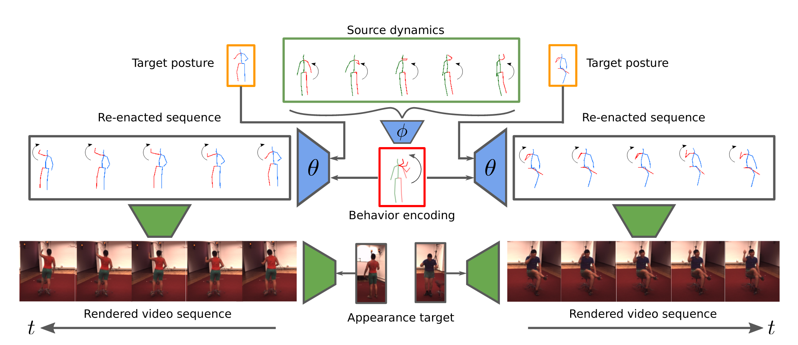

# Behavior-Driven Synthesis of Human Dynamics
Official PyTorch implementation of Behavior-Driven Synthesis of Human Dynamics.
## [Arxiv](https://arxiv.org/abs/2103.04677) | [Project Page](https://compvis.github.io/behavior-driven-video-synthesis/) | [BibTeX](#bibtex)

[Andreas Blattmann](https://www.linkedin.com/in/andreas-blattmann-479038186/?originalSubdomain=de)\*,
[Timo Milbich](https://timomilbich.github.io/)\*,
[Michael Dorkenwald](https://mdork.github.io/)\*,
[Björn Ommer](https://hci.iwr.uni-heidelberg.de/Staff/bommer),
[CVPR 2021](http://cvpr2021.thecvf.com/)<br/>
\* equal contribution


**TL;DR:** Our approach for human behavior transfer: Given a source sequence of human dynamics our model infers a behavior encoding which is independent of posture. We can re-enact the behavior by combining it with an unrelated target posture and thus control the synthesis process. The resulting sequence is combined with an appearance to synthesize a video sequence




## Requirements
After cloning the repository, a suitable [conda](https://conda.io/) environment named `behavior_driven_synthesis` can be created
and activated with:

```
$ cd behavior-driven-video-synthesis
$ conda env create -f environment.yaml
$ conda activate behavior_driven_synthesis
```

## Data preparation

### Human3.6m

The [Human3.6m-Dataset](http://vision.imar.ro/human3.6m/description.php) is the main dataset for evaluating the capbilities of our model. Prior to downloading the data, you'll have to [create an account](https://vision.imar.ro/human3.6m/main_login.php). As soon as this is done, download the `.tar.gz`-archives containing the videos and 3d pose annotations for each subject. You don't need to download all 3d pose annotations but only the ones named `D3_Positions_mono_universal`.
 
The root directory of the downloaded data will hereafter be refered to as `<DATADIR_H36M>`. In this directory, create a folder `archives`, save all the downloaded archives therein and execute the extraction and processing scripts from the root of this directory 
```shell script
$ python -m data.extract_tars --datadir <DATADIR_H36M>
$ ... the script creates a subdirectory 'extracted', for the extracted archives...
$ python -m data.process --datadir <DATADIR_H36M>
``` 

 
After that, the `archives`- and `extracted`-directories can be deleted. The data-containing directory `<DATADIR_H36M>` should then have the following structure:
```
$<DATADIR_H36M>
├── processed
    ├── all    
        ├── S1 # <subject_id>
            ├── Directions-1 # <action_id>-<subaction_id>
                ├── ImageSequence
                    ├── 54138969 # <camera_id>
                        ├── img_000001.jpg
                        ├── img_000002.jpg
                        ├── img_000003.jpg
                        ├── ... 
                    ├── 55011271 
                        ├── ... 
            ├── Directions-2
                ├── ... 
        ├── S2
            ├── ...
        ├── ... 
├── ...
```

The after that, download and extract the [preprocessed annotion file](https://heibox.uni-heidelberg.de/f/733220993b1449dc99db/) to `<DATADIR_H36M/processed/all>`.   


### DeepFashion and Market

Download the archives `deepfashion.tar.gz` and `market.tar.gz` from [here](https://heibox.uni-heidelberg.de/d/71842715a8/?p=%2Fvunet&mode=list) and unpack the datasets in two distinct directories (they will later be refered to as `<DATADIR_DEEPFASHION>` and `<DATADIR_MARKET>`).

## Training

### Behavior net

To train our final behavior model from scratch, you have to adjust the sub-field `data: datapath` in the accompanying file `config/behavior_net.yaml` such that it contains the path to `<DATADIR_H36M>`. Otherwise, the data will not be found. Apart from this, you can change the name of your run by adapting the field `general: project_name`. Lastly, all the logs, configs and checkpoints will be stored in the path specified in `general: base_dir`, which is by default the root of the cloned repository. We recommend to use the same `base_dir` for all behavior models.  


After adjusting the configuration file, you can start a training run via 
```shell script
$ python main.py --config config/behavior_net.yaml --gpu <gpu_id>
```

This will train our presented cVAE model in a first stage, prior to optimizing the parameters of the proposed normalizing flow model. 

If intending to use a pretrained cVAE model and train additional normalizing flow models, you can simply set the field `general: project_name` to the `project_name` of the pretrained cVAE and enable flow training via
```shell script
$ python main.py --config config/behavior_net.yaml --gpu <gpu_id> --flow
```

To resume a cVAE model from the latest checkpoin, again specify the `project_name` of the run to restart and use
```shell script
$ python main.py --config config/behavior_net.yaml --gpu <gpu_id> --restart
```


### Shape-and-posture net

Depending on the dataset you want use for training, some fields of the configuration file `config/shape_and_pose_net.yaml` have to be adjusted according to the following table:

| Field Name  | Human3.6m | DeepFashion |  Market1501 
| ------------- | ------------- |-------------  | -------------  |
| `data: dataset` | `Human3.6m` | `DeepFashion` | `Market` |
| `data: datapath` | `<DATADIR_H36M>` | `<DATADIR_DEEPFASHION>` | `<DATADIR_MARKET>` |
| `data: inplane_normalize` | `False` | `True` | `True` |
| `data: spatial_size` | `256` | `256` | `128` |
| `data: bottleneck_factor` | `2` | `2` | `1` |
| `data: box` | `2` | `2` | `1` |

After that, training can be started via 
```shell script
$ python main.py --config config/shape_and_pose_net.yaml --gpu <gpu_id>
```

Similar to the behavior model, a training run can be resumed by changing the value of `general: project_name` to the name of this run and then using 
 ```shell script
$ python main.py --config config/shape_and_pose_net.yaml --gpu <gpu_id> --restart
```

## Pretrained models and evaluation

The weights of all our pretrained final models can be downloaded from [this link](https://heibox.uni-heidelberg.de/d/7f34bca58c094d5595de/). Save the checkpoints together with the respective hyperparameters (which are contained in the files `config.yaml`) for each unique model in a unique directory. Evaluation can then be started via the command
```shell
$ python main.py --pretrained_model <path_to_model_directory> --gpu <gpu_id> --config <config_file>
```
where `<config_file>` is `config/behavior_net.yaml` for the pretrained behavior model and `config/shape_and_pose_net.yaml` for on of the pretrained shape-and-posture models.

To evaluate a model which was trained from scratch, simply set the field `project_name` in the respective `<config_file>` to be the name of the model to be evaluated (similar to the procedure for resuming training) and start evaluation via 
```shell
$ python main.py --gpu <gpu_id> --config <config_file> --mode infer
```
where `<config_file>` is again `config/behavior_net.yaml` for a behavior model and `config/shape_and_pose_net.yaml` for a shape-and-posture model.


## BibTeX

```
@misc{blattmann2021behaviordriven,
      title={Behavior-Driven Synthesis of Human Dynamics}, 
      author={Andreas Blattmann and Timo Milbich and Michael Dorkenwald and Björn Ommer},
      year={2021},
      eprint={2103.04677},
      archivePrefix={arXiv},
      primaryClass={cs.CV}
}
```
